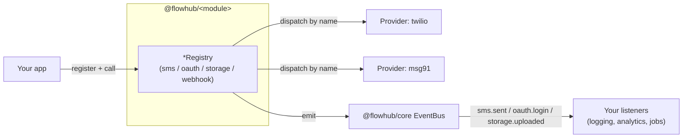

# FlowKit

**One typed interface per backend concern. Any provider behind it. Zero rewrites when you switch.**

[](https://www.npmjs.com/package/@flowhub/core)
[](LICENSE)
[](package.json)
[](tsconfig.base.json)
[](pnpm-workspace.yaml)

FlowKit is 15 small, independently publishable packages — `sms`, `email`, `oauth`, `storage`, `otp`, `webhook`, `queue`, `cache`, plus `core`/`express`/`cli` — that replace direct provider SDK calls scattered across a codebase with one registry per concern. You write a business flow once against the interface; the provider underneath is a config change, not a refactor.

## Table of Contents

- [Try it in 60 seconds](#try-it-in-60-seconds)
- [The problem](#the-problem)
- [Architecture](#architecture)
- [Before / After](#before--after)
- [Why it's faster](#why-its-faster)
- [Packages](#packages)
- [All-in-one: @flowhub/flowhub](#all-in-one-flowhubflowhub)
- [Installation](#installation)
- [Quick Start](#quick-start)
- [CLI](#cli)
- [Usage by module](#usage-by-module)
- [Monorepo layout](#monorepo-layout)
- [Development](#development)
- [Design principles](#design-principles)
- [Security](#security)
- [Contributing](#contributing)
- [Changelog](#changelog)
- [License](#license)

## Try it in 60 seconds

Real terminal output, `@flowhub/cli@0.0.3` against the packages actually published on npm:

```console
$ npm add -g @flowhub/cli
added 3 packages in 2s

$ flowkit init my-app
  create  my-app/package.json
  create  my-app/index.js
  create  my-app/.gitignore

Next steps:
  cd my-app
  npm install
  npm start

$ cd my-app && npm install
added 3 packages, and audited 4 packages in 4s
found 0 vulnerabilities

$ flowkit add twilio
  update  package.json (+@flowhub/sms)

Run "npm install", then:

  import { SmsRegistry } from "@flowhub/sms";

  const sms = new SmsRegistry(app.events);
  sms.register({ name: "twilio", /* implement the provider */ });

$ npm install && npm start
> my-app@0.0.1 start
> node index.js

FlowKit app ready
Run "flowkit add <provider>" to wire up sms, email, oauth, storage, webhook, queue, or cache.
```

`flowkit add <provider>` recognizes providers across every module — `twilio`/`msg91`/`sns`/`vonage`/`textlocal` (sms), `resend`/`sendgrid`/`smtp`/`mailgun`/`ses` (email), `google`/`github`/`microsoft` (oauth), `s3`/`cloudinary`/`gcs`/`azure-blob`/`minio` (storage), `stripe` (webhook), `bullmq`/`rabbitmq`/`sqs` (queue), `redis`/`lru` (cache) — and tells you which module it wired in if you pass one it doesn't recognize. Full command reference: [`@flowhub/cli` README](packages/cli/README.md).

## The problem

A typical backend ends up with SDK calls for Twilio, Stripe-style OAuth, S3, and BullMQ spread across a dozen files, each with its own error shape, its own retry logic (or none), and its own way of telling the rest of the app "this thing happened." Swapping Twilio for MSG91, or adding a second OAuth provider, means hunting down every call site.

FlowKit's answer: one `Provider`/`Verifier` interface per concern, one `Registry` that dispatches to it by name, one `EventBus` that every registry reports to. Business logic depends on the interface, never the SDK.

## Architecture



Swapping `ProviderA` for `ProviderB` is a `register()` call, not a find-and-replace across the codebase. Every listener downstream of the event bus keeps working unmodified.

## Before / After

**Multi-provider SMS with automatic failover and retry.** Hand-rolled, this is the code most teams actually ship:

```ts
// Without FlowKit — provider logic, retry logic, and event logic all inlined
async function sendOtpSms(to: string, body: string) {
  for (const attempt of [1, 2, 3]) {
    try {
      await twilioClient.messages.create({ to, body, from: TWILIO_FROM });
      analytics.track("sms.sent", { provider: "twilio", to });
      return;
    } catch (twilioErr) {
      if (attempt === 3) {
        try {
          await msg91Client.send({ to, body }); // second provider, different call shape
          analytics.track("sms.sent", { provider: "msg91", to });
          return;
        } catch (msg91Err) {
          analytics.track("sms.failed", { to, error: msg91Err });
          throw msg91Err;
        }
      }
      await new Promise((r) => setTimeout(r, 200 * attempt)); // backoff, written by hand
    }
  }
}
```

```ts
// With FlowKit — retry and fallback are composition, not hand-written control flow
import { SmsRegistry } from "@flowhub/sms";
import { retry } from "@flowhub/retry";

const sms = new SmsRegistry(app.events); // events wired once, for every provider
sms.register(twilioProvider);
sms.register(msg91Provider);

app.events.on("sms.sent", ({ provider, to }) => analytics.track("sms.sent", { provider, to }));
app.events.on("sms.failed", ({ provider, to, error }) => analytics.track("sms.failed", { provider, to, error }));

async function sendOtpSms(to: string, body: string) {
  try {
    await retry(() => sms.send("twilio", to, body), { attempts: 3, delayMs: 200, backoff: "exponential" });
  } catch {
    await sms.send("msg91", to, body); // fallback provider, same call shape
  }
}
```

Same behavior, but the event wiring, backoff math, and per-provider error handling live in `@flowhub/retry` / `@flowhub/sms` / `@flowhub/core` — written once, tested once ([packages/retry/src/index.test.ts](packages/retry/src/index.test.ts), [packages/sms/src/index.test.ts](packages/sms/src/index.test.ts)), reused everywhere. Adding a third fallback provider is one `register()` call, not another nested `catch`.

**Caching an expensive OAuth token refresh:**

```ts
// Without FlowKit — cache check, TTL, and refresh call interleaved by hand
const tokenCache = new Map<string, { token: string; expiresAt: number }>();
async function getAccessToken(userId: string) {
  const cached = tokenCache.get(userId);
  if (cached && Date.now() < cached.expiresAt) return cached.token;
  const { accessToken } = await oauthClient.refreshToken(userId); // blocks every miss
  tokenCache.set(userId, { token: accessToken, expiresAt: Date.now() + 55 * 60_000 });
  return accessToken;
}
```

```ts
// With FlowKit — cache and registry compose, TTL logic isn't rewritten per call site
import { CacheRegistry, MemoryCacheBackend } from "@flowhub/cache";

const cache = new CacheRegistry();
cache.register(new MemoryCacheBackend()); // swap for a Redis backend with zero call-site changes

async function getAccessToken(userId: string) {
  const backend = cache.get("memory");
  const cached = await backend.get(`token:${userId}`);
  if (cached) return cached as string;
  const { accessToken } = await oauth.refresh("google", userId);
  await backend.set(`token:${userId}`, accessToken, 55 * 60_000);
  return accessToken;
}
```

## Why it's faster

Not "faster CPU cycles" — faster to build, faster to change, faster to recover:

- **Fewer redundant network calls.** `@flowhub/cache` sits in front of expensive provider calls (token refresh, signed URLs); a cache hit skips the round-trip entirely. `@flowhub/retry`'s backoff avoids hammering a provider that's already failing.
- **No migration rewrites.** Providers are swapped by changing what you `register()`, not by touching every call site — see [Before / After](#before--after). A provider outage or pricing change becomes a config change, not a sprint.
- **Compile-time safety, not runtime surprises.** Every `*Provider` interface is a TypeScript contract (strict mode, [tsconfig.base.json](tsconfig.base.json)). A provider that doesn't implement `send()` correctly fails `tsc`, not a 3am page.
- **One failure path, not N.** `ProviderNotFoundError` / `InvalidSignatureError` / `CooldownError` are the only error shapes you handle, regardless of how many providers sit behind a registry — see the [`@flowhub/errors` README](packages/errors/README.md).
- **Observability for free.** Every registry emits to the same `EventBus`. Add a listener once (logging, metrics, a queue job) and it fires for every provider behind every registry — no per-SDK instrumentation.
- **Less code to review and ship.** The retry+fallback example above is 4 lines of composition instead of 18 lines of hand-rolled control flow. That gap only grows as providers are added.

## Packages

| Package | Description | Docs |
|---|---|---|
| `@flowhub/core` | Configuration, lifecycle, plugin loading, DI, event bus | [README](packages/core/README.md) |
| `@flowhub/express` | Route registration for OAuth callback and webhook endpoints | [README](packages/express/README.md) |
| `@flowhub/cli` | `flowkit init` / `flowkit add <provider>` commands | [README](packages/cli/README.md) |
| `@flowhub/config` | Config loading, merging, required-key validation | [README](packages/config/README.md) |
| `@flowhub/logger` | Minimal leveled logger | [README](packages/logger/README.md) |
| `@flowhub/errors` | Shared error types (`FlowKitError`, `ProviderNotFoundError`) | [README](packages/errors/README.md) |
| `@flowhub/retry` | Retry helper with fixed/exponential backoff | [README](packages/retry/README.md) |
| `@flowhub/storage` | Object storage registry (S3, Cloudinary, GCS, Azure Blob, MinIO) | [README](packages/storage/README.md) |
| `@flowhub/sms` | SMS registry (Twilio, MSG91, AWS SNS, Vonage, Textlocal) | [README](packages/sms/README.md) |
| `@flowhub/oauth` | OAuth registry (Google, GitHub, Microsoft) — PKCE, state, refresh | [README](packages/oauth/README.md) |
| `@flowhub/email` | Email registry (Resend, SendGrid, SMTP, Mailgun, SES) | [README](packages/email/README.md) |
| `@flowhub/otp` | OTP generation, verification, expiry, resend cooldown | [README](packages/otp/README.md) |
| `@flowhub/webhook` | Inbound webhook signature verification | [README](packages/webhook/README.md) |
| `@flowhub/queue` | Job queue registry (BullMQ, RabbitMQ, Redis, SQS) | [README](packages/queue/README.md) |
| `@flowhub/cache` | Cache registry (Memory, Redis, LRU) | [README](packages/cache/README.md) |
| `@flowhub/flowhub` | Meta-package — re-exports all 15 packages above, one install | [README](packages/flowhub/README.md) |

Each README covers the full API, every method/event, and usage examples beyond what's inlined below. All packages are published to npm under the [`@flowhub`](https://www.npmjs.com/org/flowhub) org — install any of them directly, no monorepo checkout required.

## All-in-one: @flowhub/flowhub

Don't want to run fifteen `pnpm add` commands? [`@flowhub/flowhub`](packages/flowhub/README.md) is a meta-package that re-exports every symbol from every package above — same classes, same functions, zero API differences, just one import:

```bash
pnpm add @flowhub/flowhub
```

```ts
import { createApp, SmsRegistry, OAuthRegistry, OtpManager, retry } from "@flowhub/flowhub";
```

is exactly equivalent to installing and importing `@flowhub/core`, `@flowhub/sms`, `@flowhub/oauth`, `@flowhub/otp`, and `@flowhub/retry` individually. Its [README](packages/flowhub/README.md) documents every re-exported class/function from all 15 packages in one place, with a full worked example (OTP-gated signup using `sms`, `otp`, `cache`, and `retry` together).

Use it for prototyping or services that touch most of the toolkit. For production services using only a handful of modules, installing those directly keeps the dependency tree smaller and lets each module version independently — see the [comparison table](packages/flowhub/README.md#when-to-use-this-vs-the-individual-packages) in its README. Switching between the two later is a find-and-replace on import paths, since the exports are identical.

## Installation

Install only what you need:

```bash
pnpm add @flowhub/core @flowhub/sms @flowhub/oauth
# or npm / yarn
```

Or grab everything in one package — see [`@flowhub/flowhub`](packages/flowhub/README.md#when-to-use-this-vs-the-individual-packages) for the tradeoff:

```bash
pnpm add @flowhub/flowhub
```

Node.js 20+ required.

## Quick Start

```ts
import { createApp } from "@flowhub/core";
import { SmsRegistry } from "@flowhub/sms";

const app = createApp({ env: "production" });

const sms = new SmsRegistry(app.events);
sms.register({
  name: "twilio",
  async send(to, body) {
    // call the real Twilio SDK here
  },
});

app.events.on("sms.sent", ({ provider, to }) => {
  console.log(`sms sent via ${provider} to ${to}`);
});

await sms.send("twilio", "+15551234567", "Your code is 482913");
```

Every provider-backed package (`sms`, `email`, `oauth`, `storage`, `webhook`) follows the same shape: a `*Provider`/`*Verifier` interface you implement, and a `*Registry` you register it with. Pass a `@flowhub/core` `EventBus` to a registry to get `sms.sent`/`sms.failed`, `oauth.login`/`oauth.refresh`, `storage.uploaded`, and `webhook.received`/`webhook.rejected` events for free.

📖 Full API: [`@flowhub/core` README](packages/core/README.md) · [`@flowhub/sms` README](packages/sms/README.md)

## CLI

```bash
pnpm add -g @flowhub/cli

flowkit init my-app        # scaffold a new project
flowkit add twilio         # add a provider to the current project
```

📖 Full API: [`@flowhub/cli` README](packages/cli/README.md)

## Usage by module

<details>
<summary><strong>OAuth — register once, mount everywhere</strong></summary>

```ts
import { OAuthRegistry } from "@flowhub/oauth";
import { registerOAuthRoutes } from "@flowhub/express";

const oauth = new OAuthRegistry(app.events);
oauth.register({
  name: "google",
  buildAuthorizeUrl: (state) => `https://accounts.google.com/o/oauth2/auth?state=${state}`,
  exchangeCode: async (code, state) => ({ accessToken: "...", refreshToken: "..." }),
  refresh: async (refreshToken) => ({ accessToken: "..." }),
});

// Mounts /oauth/:provider and /oauth/:provider/callback — adding "github" later
// is another oauth.register() call, this line doesn't change.
registerOAuthRoutes(expressRouter, {
  authorize: (req, res) => res.json({ url: oauth.authorize(req.params.provider, crypto.randomUUID()) }),
  callback: async (req, res) => res.json(await oauth.handleCallback(req.params.provider, req.query.code, req.query.state)),
});
```

📖 Full API and more examples: [`@flowhub/oauth` README](packages/oauth/README.md) · [`@flowhub/express` README](packages/express/README.md)
</details>

<details>
<summary><strong>Webhooks — signature verification without leaking provider quirks</strong></summary>

```ts
import { WebhookRegistry, InvalidSignatureError } from "@flowhub/webhook";

const webhooks = new WebhookRegistry(app.events);
webhooks.register({
  name: "stripe",
  verify: (payload, signature) => verifyStripeSignature(payload, signature),
});

try {
  webhooks.receive("stripe", rawBody, signatureHeader); // emits webhook.received
} catch (err) {
  if (err instanceof InvalidSignatureError) return res.sendStatus(400); // emits webhook.rejected first
  throw err;
}
```

📖 Full API and more examples: [`@flowhub/webhook` README](packages/webhook/README.md)
</details>

<details>
<summary><strong>OTP — expiry and cooldown handled, not reimplemented per feature</strong></summary>

```ts
import { OtpManager, CooldownError } from "@flowhub/otp";

const otp = new OtpManager({ ttlMs: 5 * 60_000, cooldownMs: 30_000 });

try {
  const code = otp.generate("+15551234567");
  await sms.send("twilio", "+15551234567", `Your code is ${code}`);
} catch (err) {
  if (err instanceof CooldownError) return res.status(429).json({ message: err.message });
}

otp.verify("+15551234567", code); // true once, false on replay or after expiry
```

📖 Full API and more examples: [`@flowhub/otp` README](packages/otp/README.md)
</details>

<details>
<summary><strong>Storage, Queue, Cache — same registry pattern, zero new concepts</strong></summary>

```ts
import { StorageRegistry } from "@flowhub/storage";
import { QueueRegistry, MemoryQueueBackend } from "@flowhub/queue";
import { CacheRegistry, MemoryCacheBackend } from "@flowhub/cache";

const storage = new StorageRegistry(app.events);
storage.register({ name: "s3", upload: async (key, data) => ({ url: `https://cdn/${key}` }) });
await storage.upload("s3", "avatar.png", buffer); // emits storage.uploaded

const queue = new QueueRegistry();
queue.register(new MemoryQueueBackend()); // swap for BullMQ/SQS backend, same enqueue/dequeue calls
await queue.enqueue("memory", { type: "resize-image" });

const cache = new CacheRegistry();
cache.register(new MemoryCacheBackend()); // swap for Redis, same get/set calls
await cache.get("memory").set("key", "value", 60_000);
```

📖 Full API and more examples: [`@flowhub/storage` README](packages/storage/README.md) · [`@flowhub/queue` README](packages/queue/README.md) · [`@flowhub/cache` README](packages/cache/README.md)
</details>

## Monorepo layout

```text
flowkit/
  packages/       # 15 concern packages + @flowhub/flowhub meta-package (16 total, all publishable)
  tests/          # cross-package integration flow tests (@flowhub/tests, private)
```

Each package builds with [tsup](https://tsup.egoist.dev) to ESM + CJS + `.d.ts`, and tests with [Vitest](https://vitest.dev). See [tests/integration](tests/integration) for the end-to-end flows (OAuth callback, webhook verification, OTP delivery, queue+cache, and a contract test asserting every documented event name is actually emitted).

## Development

```bash
pnpm install
pnpm build           # builds all packages
pnpm test            # unit tests (all packages) + integration flow tests
pnpm typecheck        # tsc --noEmit across the workspace
```

Run a single package's scripts with `pnpm --filter @flowhub/<name> run <script>`.

## Design principles

- Provider agnostic
- Modular
- Extensible
- Secure defaults
- Excellent developer experience

## Security

Found a vulnerability? Do not open a public issue — see [SECURITY.md](SECURITY.md) for how to report it privately.

## Contributing

Bug reports, provider implementations, and PRs are welcome — see [CONTRIBUTING.md](CONTRIBUTING.md) for local setup, the test/typecheck gate every PR must pass, and commit conventions.

## Changelog

Notable changes per release are tracked in [CHANGELOG.md](CHANGELOG.md).

## License

[MIT](LICENSE)
